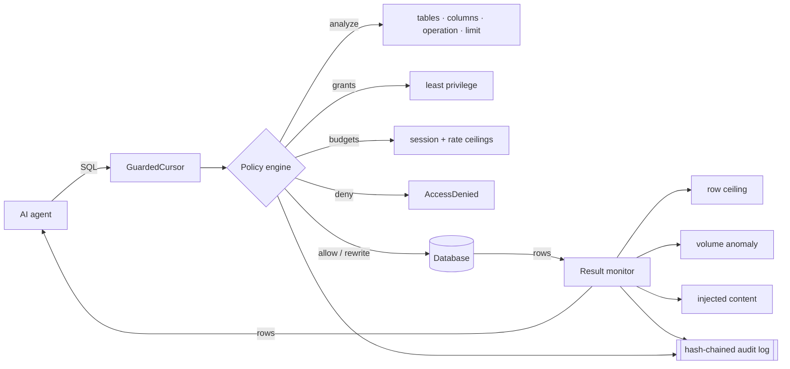

# dataweir

**A data-layer guardrail and activity monitor for AI agents.**

[](https://pypi.org/project/dataweir/)
[](https://pypi.org/project/dataweir/)
[](https://pepy.tech/project/dataweir)
[](https://github.com/skv-se/dataweir/actions/workflows/ci.yml)
[](LICENSE)

A weir is a low dam that both *controls* and *measures* flow. That is the job here: sit at the
query boundary between an agent and its data, enforce least-privilege access, meter every row that
crosses, and say something when the volume or the content stops looking normal.

```bash
pip install dataweir
```

---

## Why the data layer

Most agent security tooling works on prompts, tool schemas, or the MCP transport. All useful. But
an agent that has been talked into exfiltrating your customer table does not announce it in the
prompt — it issues a perfectly ordinary `SELECT`, and the damage is measured in rows.

dataweir watches the place where the rows actually move:

| Question | Prompt/tool-layer guardrail | dataweir |
| --- | --- | --- |
| Is the agent allowed to touch `customers`? | Only if the tool is named that way | Yes — reads the SQL the database receives |
| Did that call return 40 rows or 4,000,000? | No | Yes |
| Was `ssn` in the projection? | No | Yes, including via `SELECT *` |
| Has this agent drawn more today than it did all last week? | No | Yes |
| Is there an injected instruction sitting *in a row*? | Only if it reaches the prompt | Yes, at the point of retrieval |

It is the Database Activity Monitoring idea — the control that regulated enterprises have run in
front of human and application database access for twenty years — applied to non-human identities
that make a thousand decisions a minute.

---

## 60 seconds

```bash
dataweir policy init          # write a starter dataweir.yaml
dataweir scan                 # red-team it before an agent does
```

```python
import sqlite3
from dataweir import Policy, guard

policy = Policy.load("dataweir.yaml")
conn = guard(sqlite3.connect("app.db"), policy, agent="support-copilot")

cur = conn.cursor()
cur.execute("SELECT id, status FROM tickets WHERE owner = ?", ("ana",))
rows = cur.fetchall()
```

That is the whole integration. `guard()` returns an ordinary DB-API connection — every driver
method still works — so it drops into an existing agent without touching the agent's code.

The default mode is `monitor`: nothing is blocked and nothing is rewritten. You get an audit log
and a scan report first, and you turn on enforcement when the log looks the way you expect.

---

## How it works



Two decision points, because they answer different questions:

- **Before the query** — may this agent run this statement, on these tables, touching these
  columns, given what it has already drawn this session? Analysis is a real SQL parse
  ([sqlglot](https://github.com/tobymao/sqlglot)), not a regex, so `SELECT *`, joins, subqueries and
  stacked statements are all seen for what they are.
- **After the rows come back** — how many were there, is that normal for this query shape, and does
  any cell contain text that reads like an instruction?

---

## Policy

Deny by default. An agent may do exactly what a grant allows.

```yaml
version: 1
name: production
default: deny
mode: monitor        # monitor | warn | enforce

audit:
  path: ./dataweir-audit.jsonl
  hash_chain: true
  redact_params: true

classification:
  sensitive_columns: ["*.ssn", "*.password*", "*.card_number"]
  pii_columns: ["*.email", "*.phone"]

agents:
  - id: support-copilot
    grants:
      - tables: [tickets]
        operations: [select]
        max_rows: 200
      - tables: [customers]
        operations: [select]
        columns: [customers.id, customers.name, customers.tier]
        deny_columns: [customers.ssn, customers.email]
        max_rows: 50
    budgets:
      rows_per_session: 2000
      rows_per_minute: 500
      sensitive_rows_per_session: 0
    anomaly:
      row_zscore: 4.0
      min_observations: 20
```

**Modes.** `monitor` records and changes nothing — safe to install in front of a running agent.
`warn` additionally raises a Python warning. `enforce` raises `AccessDenied` on a blocking verdict
and caps oversized reads by injecting a `LIMIT` the agent did not ask for.

---

## Controls

Every finding has a stable code, a severity, and a mapping to the
[OWASP Top 10 for Agentic Applications](https://genai.owasp.org/2025/12/09/owasp-top-10-for-agentic-applications-the-benchmark-for-agentic-security-in-the-age-of-autonomous-ai/)
(ASI01–ASI10, published December 2025).

| Code | Control | Severity | OWASP |
| --- | --- | --- | --- |
| DW001 | Operation not granted | high | ASI03 |
| DW002 | Table not granted | high | ASI03 |
| DW003 | Denied column accessed | high | ASI03 |
| DW004 | Unbounded read | medium | ASI02 |
| DW005 | Row ceiling exceeded | high | ASI02 |
| DW006 | Session row budget exhausted | high | ASI02 |
| DW007 | Rate budget exceeded | medium | ASI02 |
| DW008 | Sensitive column read | medium | ASI03 |
| DW009 | Anomalous result volume | high | ASI02 |
| DW010 | Multiple statements in one call | high | ASI05 |
| DW011 | Schema or catalog enumeration | high | ASI03 |
| DW012 | Schema-altering statement | critical | ASI05 |
| DW013 | Instruction-shaped content in result data | high | ASI06, ASI01 |
| DW014 | Unparseable statement (fails closed) | high | ASI05 |
| DW015 | Wildcard projection over classified columns | medium | ASI02 |
| DW016 | Unknown agent identity | critical | ASI10, ASI03 |
| DW017 | Unfiltered write | high | ASI02 |

```bash
dataweir controls          # the whole catalog
dataweir controls DW009    # one control, with the fix
```

---

## `dataweir scan` — red-team your own policy

```bash
dataweir scan --policy dataweir.yaml
```

Two passes, both offline. No database connection is opened, so it belongs in CI.

**Static checks** read the policy the way an attacker would: wildcard grants, read grants with no
row ceiling, auditing switched off, agents holding DDL rights, unfiltered writes.

**Probes** submit fourteen known-bad data operations through the real policy engine with
enforcement forced on, and pass only when the engine refuses them:

| Probe | What it tries |
| --- | --- |
| DWP001 | Unbounded table read |
| DWP002 | Access to an ungranted table |
| DWP003 | Lateral join to an ungranted table |
| DWP004 | Denied column read |
| DWP005 | Wildcard around a column denial |
| DWP006/007 | Schema enumeration (`sqlite_master`, `information_schema`) |
| DWP008 | Stacked statements |
| DWP009 | Write through a read-only grant |
| DWP010 | Unfiltered delete |
| DWP011 | Schema alteration |
| DWP012 | Sensitive column read |
| DWP013 | Query as an unknown identity |
| DWP014 | Instruction-shaped text returned in a row |

```bash
dataweir scan --format json -o scan.json --fail-on high
```

Exits non-zero when anything at or above `--fail-on` is found, so a policy regression fails the
build.

---

## Audit log

One JSON object per decision, hash-chained. Editing or deleting any line breaks the chain from
that point on, and the tool will say exactly where.

Two records are written per query: the `decision` (the pre-execution verdict)
and the `result` (how many rows actually came back). The row count is the point
of a data-activity monitor, so it is logged whether or not anything went wrong —
set `audit.log_results: false` to keep decisions only.

```bash
dataweir audit tail --blocked -n 20
dataweir audit tail --event result --agent support-copilot
dataweir audit summary
dataweir audit verify
```

One record, reformatted for readability (they are written one per line):

```json
{
  "seq": 1,
  "ts": "2026-08-23T21:56:55.330Z",
  "event": "decision",
  "agent_id": "support-copilot",
  "session_id": "e6b4e07280df4056",
  "policy": "starter",
  "mode": "monitor",
  "verdict": "block",
  "action": "observed",
  "operation": "select",
  "tables": ["customers"],
  "sql": "SELECT ssn FROM customers",
  "row_limit": 50,
  "classified_columns": { "customers.ssn": "sensitive" },
  "max_severity": "high",
  "findings": [
    {
      "code": "DW003",
      "title": "Denied column accessed",
      "severity": "high",
      "subject": "customers.ssn",
      "detail": "column 'customers.ssn' is explicitly denied for this agent",
      "owasp": ["ASI03"]
    }
  ],
  "prev_hash": "431f40da…",
  "hash": "d724a00e…"
}
```

`verdict` is what the policy says; `action` is what happened once mode was
applied. Here they differ because the policy is still in monitor mode — the read
went through, and the log says it should not have.

Bound parameters are redacted by default — they carry the very values the log exists to protect.

Hash chaining makes tampering *evident*, not impossible: someone who can rewrite the whole file can
re-chain it. Ship records to a SIEM or append-only store if you need more than that.

---

## Where this sits

dataweir is not a replacement for prompt-level guardrails, an MCP gateway, or a red-teaming
framework. It covers the layer underneath them, and composes with all three.

- **NeMo Guardrails, Guardrails AI, LlamaFirewall** — govern what the model says and which tools it
  may call. dataweir governs what the query may touch and how much may come back.
- **MCP gateways and proxies** — govern the transport between agent and tool server. dataweir sits
  behind whichever tool actually holds the database handle.
- **garak, PyRIT, promptfoo** — red-team the model. `dataweir scan` red-teams your *data policy*.

---

## Roadmap

v0.1 is the DB-API surface. Next, in order:

- SQLAlchemy `Engine`-level integration with full result accounting
- Async drivers (`asyncpg`, `aiosqlite`)
- Live-target probing against a real connection, not only the engine
- OpenTelemetry span export alongside the JSONL log
- Adapters for MCP tool servers and LangChain/LlamaIndex retrievers
- Policy generation from an observed audit log ("here is what your agent actually did — grant that")

Issues and PRs welcome, particularly real-world policies and the dialect edge cases they expose.

---

## Contributing

```bash
git clone https://github.com/skv-se/dataweir && cd dataweir
python -m venv .venv && source .venv/bin/activate
pip install -e ".[dev]"
pytest
ruff check .
```

See [CONTRIBUTING.md](CONTRIBUTING.md). By participating you agree to the
[Code of Conduct](CODE_OF_CONDUCT.md). Security issues: [SECURITY.md](SECURITY.md).

## License

Apache-2.0. See [LICENSE](LICENSE).
